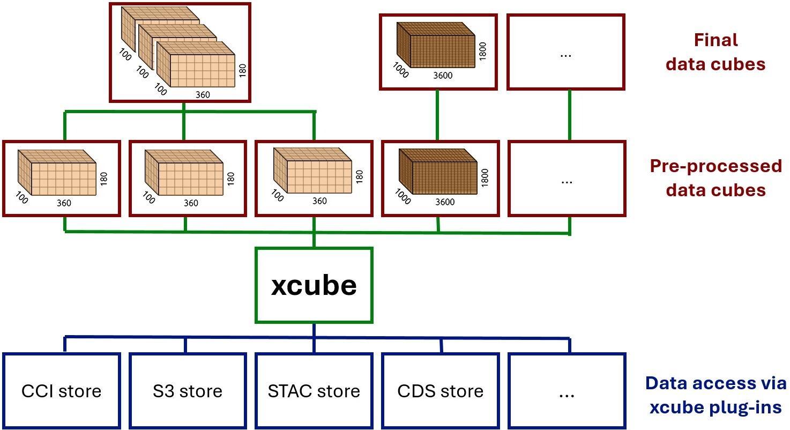

# Multi-Source Data Store 

This repository aims to delevop the frame work of a Multi-Source Data Store to formalize
the fusion of data from various sources into a harmonized format. This approach will not 
only streamline the integration process but also ensure its **transparency** and 
**reproducibility** through well-defined configurations.

The concept of such a Multi-Source Data Store is illustrated in the figure below. It
contains the following steps:

1. Data access through xcube data store plug-ins
2. Data harmonization
3. Data fusion if required 

This can result in either one unified data cube with all datasets on a consistent grid
or a catalog of separate datasets. 

{#fig:multi_source_store}

## Requirements from the EO-LINCS project
* different time axis possible, e.g. hourly ERA5 and irregular Sen2 observations
* grid mapping may be defined by the user or by a dataset 
* allow for time series at a single spatial point 
* maybe support frame work, which allows to define a point and the size of the bounding 
  box edge (used in DeepExtremes, DeepFeatures, EO-LINCS SCS 1&3)
* some python function as a config generator
* should deal with preloading, should it wait till preload is done, or should it deal
  with other datasets in the mean time 
* interpolate along time axis (optional)
* allow to write to netcdf and zarr

## Requirement from xcube / BC